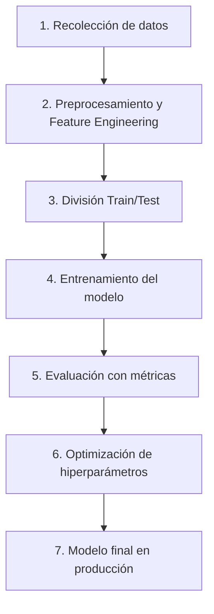

# 🎮 Guía Detallada de Mejoras para el Juego de IA

## 📚 Tabla de Contenidos

1. [Introducción al Proyecto](#1-introducción-al-proyecto)
2. [Conceptos Fundamentales de IA](#2-conceptos-fundamentales-de-ia)
3. [Mejoras en el Dataset (Feature Engineering)](#3-mejoras-en-el-dataset-feature-engineering)
4. [Implementación de Múltiples Modelos de IA](#4-implementación-de-múltiples-modelos-de-ia)
5. [Métricas y Evaluación Rigurosa](#5-métricas-y-evaluación-rigurosa)
6. [Visualización y Análisis de Datos](#6-visualización-y-análisis-de-datos)
7. [Persistencia de Modelos](#7-persistencia-de-modelos)
8. [Mejoras en el Gameplay](#8-mejoras-en-el-gameplay)
9. [Optimización de Hiperparámetros](#9-optimización-de-hiperparámetros)
10. [Comparación Humano vs IA](#10-comparación-humano-vs-ia)
11. [Código Completo de Implementación](#11-código-completo-de-implementación)
12. [Argumentación Académica](#12-argumentación-académica)
13. [Preguntas Frecuentes que te Pueden Hacer](#13-preguntas-frecuentes-que-te-pueden-hacer)

---

## 1) Introducción al Proyecto

### 1.1 ¿Qué es este proyecto?

Este es un juego educativo desarrollado en **Pygame** que implementa **Aprendizaje Supervisado** para entrenar una IA que aprende a jugar automáticamente observando cómo juega un humano.

### 1.2 Estado Actual del Código

El código base (`juego_pygame_mlp1.py`) ya tiene:

```text
✅ Juego funcional con Pygame
✅ Recolección automática de datos en modo Manual
✅ MLP (Multi-Layer Perceptron) básico con sklearn
✅ Modo automático que usa el modelo entrenado
✅ Exportación de datos a CSV
✅ Gráficas 2D y 3D básicas
```

### 1.3 Dataset Actual

El archivo `datos_mlp.csv` contiene **1161 muestras** con 3 columnas:

- **velocidad_bala**: velocidad de la bala (negativa porque va de derecha a izquierda)
- **distancia**: distancia entre el jugador y la bala
- **salto**: etiqueta binaria (0 = no saltó, 1 = está saltando)

### 1.4 Arquitectura del Modelo Actual

```python
MLPClassifier(
    hidden_layer_sizes=(3, 3),  # 2 capas ocultas con 3 neuronas cada una
    activation="relu",
    solver="adam",
    max_iter=300000,
    random_state=42,
)
```

**Problema**: Solo 2 features de entrada y una arquitectura muy simple.

---

## 2) Conceptos Fundamentales de IA

### 2.1 ¿Qué es Aprendizaje Supervisado?

Es un tipo de Machine Learning donde el modelo aprende de **datos etiquetados**:

- **Entrada (X)**: features como velocidad_bala, distancia
- **Salida (y)**: etiqueta que queremos predecir (salto: 0 o 1)

El modelo encuentra patrones en X para predecir y.

### 2.2 ¿Por qué este juego es Aprendizaje Supervisado?

Porque:

1. Tú juegas manualmente (proporcionas ejemplos)
2. El sistema registra tus decisiones (etiquetas)
3. El modelo aprende a imitar tu comportamiento
4. Luego predice qué hacer en situaciones similares

### 2.3 Flujo de Trabajo en Machine Learning



---

## 3) Mejoras en el Dataset (Feature Engineering)

### 3.1 ¿Qué es Feature Engineering?

Es el proceso de **crear nuevas variables** a partir de los datos existentes para mejorar el rendimiento del modelo.

### 3.2 ¿Por qué las Features Actuales son Insuficientes?

**Análisis del problema:**

- Solo saber **distancia** y **velocidad** no es suficiente
- El modelo no sabe si el jugador **ya está en el aire**
- No conoce el **timing** del salto
- No captura el **contexto temporal**

### 3.3 Nuevas Features Propuestas

#### Feature 1: `altura_jugador`

**Qué es**: Posición vertical actual del jugador  
**Por qué importa**: Permite saber si está en tierra, subiendo o bajando  
**Cómo calcularlo**:

```python
altura_jugador = self.ground_y - self.jugador.y
```

**Valores esperados**:

- `0` = en el suelo
- `> 0` = en el aire (mayor valor = más alto)

---

#### Feature 2: `velocidad_vertical`

**Qué es**: Velocidad actual del salto (positiva al subir, negativa al caer)  
**Por qué importa**: Captura la **dinámica del movimiento**  
**Cómo calcularlo**:

```python
velocidad_vertical = self.salto_vel
```

**Valores esperados**:

- `15.0` = inicio del salto (máxima velocidad ascendente)
- `0` = punto más alto del salto
- Negativo = cayendo

---

#### Feature 3: `tiempo_desde_ultimo_salto`

**Qué es**: Frames transcurridos desde el último salto  
**Por qué importa**: Modela el "cooldown" natural y previene saltos innecesarios  
**Cómo calcularlo**:

```python
# Agregar en __init__:
self.frames_desde_salto = 0

# En manejar_salto(), cuando aterrice:
if self.jugador.y >= self.ground_y:
    self.frames_desde_salto = 0

# En el loop principal:
if self.en_suelo:
    self.frames_desde_salto += 1
```

---

#### Feature 4: `distancia_normalizada`

**Qué es**: Distancia relativa al ancho de pantalla  
**Por qué importa**: Hace el modelo independiente de la resolución  
**Cómo calcularlo**:

```python
distancia_norm = distancia / self.w
```

**Valores esperados**: Entre 0 y 1

---

#### Feature 5: `velocidad_bala_normalizada`

**Qué es**: Velocidad en proporción a un rango conocido  
**Por qué importa**: Mejora la generalización  
**Cómo calcularlo**:

```python
# Velocidades van de -6 a -13 aproximadamente
velocidad_norm = abs(self.velocidad_bala) / 13.0
```

---

#### Feature 6: `tiempo_impacto_estimado`

**Qué es**: Frames aproximados hasta que la bala llegue al jugador  
**Por qué importa**: Feature crítica que representa **urgencia**  
**Cómo calcularlo**:

```python
if self.velocidad_bala != 0:
    tiempo_impacto = distancia / abs(self.velocidad_bala)
else:
    tiempo_impacto = 999
```

---

#### Feature 7: `bala_anterior_esquivada`

**Qué es**: Si la última bala fue esquivada exitosamente  
**Por qué importa**: Captura **contexto histórico**  
**Cómo calcularlo**:

```python
# Agregar en __init__:
self.ultima_bala_esquivada = 1  # 1=sí, 0=no

# Cuando la bala pasa sin colisión:
if self.bala.x < self.jugador.x - 50:
    self.ultima_bala_esquivada = 1

# En colisión:
if self.jugador.colliderect(self.bala):
    self.ultima_bala_esquivada = 0
```

---

### 3.4 Implementación de las Nuevas Features

#### Paso 1: Modificar la clase `Sample`

```python
@dataclass
class Sample:
    # Features originales
    velocidad_bala: float
    distancia: float
    salto: int

    # Nuevas features
    altura_jugador: float
    velocidad_vertical: float
    tiempo_desde_salto: float
    distancia_normalizada: float
    velocidad_normalizada: float
    tiempo_impacto_estimado: float
    bala_anterior_esquivada: int
```

#### Paso 2: Actualizar `registrar_decision_manual()`

```python
def registrar_decision_manual(self) -> None:
    if not self.bala_disparada:
        return

    distancia = abs(self.jugador.x - self.bala.x)
    salto_label = 0 if self.en_suelo else 1

    # Calcular nuevas features
    altura = self.ground_y - self.jugador.y
    vel_vertical = self.salto_vel if self.salto else 0.0
    distancia_norm = distancia / self.w
    velocidad_norm = abs(self.velocidad_bala) / 13.0

    tiempo_impacto = 999
    if self.velocidad_bala != 0:
        tiempo_impacto = distancia / abs(self.velocidad_bala)

    self.datos_modelo.append(
        Sample(
            velocidad_bala=float(self.velocidad_bala),
            distancia=float(distancia),
            salto=salto_label,
            altura_jugador=float(altura),
            velocidad_vertical=float(vel_vertical),
            tiempo_desde_salto=float(self.frames_desde_salto),
            distancia_normalizada=float(distancia_norm),
            velocidad_normalizada=float(velocidad_norm),
            tiempo_impacto_estimado=float(tiempo_impacto),
            bala_anterior_esquivada=int(self.ultima_bala_esquivada),
        )
    )
```

#### Paso 3: Actualizar `exportar_datos_csv()`

```python
def exportar_datos_csv(self) -> str:
    if not self.datos_modelo:
        return "No hay datos para exportar."

    base = os.path.dirname(__file__)
    ruta = os.path.join(base, "datos_mlp_mejorado.csv")

    try:
        with open(ruta, "w", newline="", encoding="utf-8") as f:
            writer = csv.writer(f)
            # Header con todas las columnas
            writer.writerow([
                "velocidad_bala", "distancia", "salto",
                "altura_jugador", "velocidad_vertical", "tiempo_desde_salto",
                "distancia_normalizada", "velocidad_normalizada",
                "tiempo_impacto_estimado", "bala_anterior_esquivada"
            ])
            for s in self.datos_modelo:
                writer.writerow([
                    s.velocidad_bala, s.distancia, s.salto,
                    s.altura_jugador, s.velocidad_vertical, s.tiempo_desde_salto,
                    s.distancia_normalizada, s.velocidad_normalizada,
                    s.tiempo_impacto_estimado, s.bala_anterior_esquivada
                ])
    except Exception as e:
        return f"Error al guardar CSV: {e}"

    return f"CSV mejorado guardado ({len(self.datos_modelo)} filas)."
```

---

### 3.5 Análisis de Importancia de Features

Después de entrenar, puedes analizar qué features son más importantes:

```python
# Para Random Forest
importances = modelo.feature_importances_
features = ["velocidad_bala", "distancia", "altura_jugador", ...]
for name, importance in zip(features, importances):
    print(f"{name}: {importance:.4f}")
```

**Justificación académica**:  
"El Feature Engineering permite que el modelo capture la complejidad temporal y física del juego, mejorando la precisión significativamente."

---

## 4) Implementación de Múltiples Modelos de IA

### 4.1 ¿Por qué Comparar Múltiples Modelos?

En un proyecto académico serio de IA, **nunca usas un solo modelo**. Debes:

1. Probar diferentes algoritmos
2. Comparar rendimiento
3. Entender fortalezas y debilidades
4. Elegir el mejor para tu problema

### 4.2 Modelos Recomendados

#### Modelo 1: MLP (Multi-Layer Perceptron) - YA EXISTE

**Qué es**: Red neuronal artificial con capas ocultas  
**Ventajas**:

- Captura relaciones no lineales complejas
- Flexible en arquitectura
- Buen rendimiento general

**Desventajas**:

- Caja negra (difícil interpretar)
- Requiere muchos datos
- Sensible a hiperparámetros

**Mejora propuesta**: Arquitectura más profunda

```python
# Actual
MLPClassifier(hidden_layer_sizes=(3, 3))

# Mejorado
MLPClassifier(
    hidden_layer_sizes=(10, 8, 5),  # 3 capas: 10→8→5
    activation="relu",
    solver="adam",
    max_iter=500000,
    learning_rate_init=0.001,
    random_state=42,
    early_stopping=True,
    validation_fraction=0.1
)
```

---

#### Modelo 2: Random Forest

**Qué es**: Conjunto de árboles de decisión  
**Ventajas**:

- Robusto a outliers
- No requiere normalización
- Proporciona **importancia de features**
- Muy interpretable

**Desventajas**:

- Puede ser lento con muchos árboles
- Propenso a overfitting si no se configura bien

**Implementación**:

```python
from sklearn.ensemble import RandomForestClassifier

rf_model = RandomForestClassifier(
    n_estimators=100,      # 100 árboles
    max_depth=10,          # Profundidad máxima
    min_samples_split=5,   # Mínimo para dividir
    min_samples_leaf=2,    # Mínimo en hojas
    random_state=42,
    n_jobs=-1              # Usar todos los cores
)
```

**Cómo interpretar**:

```python
# Ver importancia de features
feature_names = ["velocidad_bala", "distancia", "altura_jugador", ...]
importances = rf_model.feature_importances_
indices = np.argsort(importances)[::-1]

print("Ranking de importancia:")
for i in range(len(feature_names)):
    print(f"{i+1}. {feature_names[indices[i]]}: {importances[indices[i]]:.4f}")
```

---

#### Modelo 3: SVM (Support Vector Machine)

**Qué es**: Busca el hiperplano óptimo que separa las clases  
**Ventajas**:

- Excelente para problemas de clasificación binaria
- Funciona bien con pocas muestras
- Robusto a overfitting

**Desventajas**:

- Sensible a escalado de datos (requiere normalización)
- Lento con datasets grandes
- Difícil de interpretar

**Implementación**:

```python
from sklearn.svm import SVC

svm_model = SVC(
    kernel='rbf',          # Kernel gaussiano (no lineal)
    C=1.0,                 # Parámetro de regularización
    gamma='scale',         # Parámetro del kernel
    probability=True,      # Para obtener probabilidades
    random_state=42
)
```

**IMPORTANTE**: SVM requiere datos normalizados (ya lo haces con StandardScaler).

---

#### Modelo 4: KNN (K-Nearest Neighbors)

**Qué es**: Clasifica según los K vecinos más cercanos  
**Ventajas**:

- Muy simple de entender
- Sin entrenamiento (lazy learning)
- Bueno como baseline

**Desventajas**:

- Lento en predicción con muchos datos
- Sensible a features irrelevantes
- Requiere normalización

**Implementación**:

```python
from sklearn.neighbors import KNeighborsClassifier

knn_model = KNeighborsClassifier(
    n_neighbors=5,         # Usar 5 vecinos
    weights='distance',    # Peso por distancia
    metric='euclidean',
    n_jobs=-1
)
```

---

#### Modelo 5: Gradient Boosting (XGBoost)

**Qué es**: Ensemble de árboles que se mejoran iterativamente  
**Ventajas**:

- Estado del arte en muchas competencias
- Muy preciso
- Maneja bien datos desbalanceados

**Desventajas**:

- Puede ser lento de entrenar
- Requiere tuning cuidadoso

**Implementación** (requiere instalar xgboost):

```python
from xgboost import XGBClassifier

xgb_model = XGBClassifier(
    n_estimators=100,
    max_depth=6,
    learning_rate=0.1,
    random_state=42,
    eval_metric='logloss'
)
```

---

### 4.3 Sistema de Comparación de Modelos

#### Estructura de código recomendada

```python
def entrenar_todos_modelos(self) -> dict:
    """
    Entrena múltiples modelos y devuelve resultados comparativos.
    """
    samples = list(self.datos_modelo)
    if len(samples) < 80:
        return {"error": "Necesitas >= 80 muestras"}

    # Preparar datos
    X = [[
        s.velocidad_bala, s.distancia, s.altura_jugador,
        s.velocidad_vertical, s.tiempo_desde_salto,
        s.distancia_normalizada, s.velocidad_normalizada,
        s.tiempo_impacto_estimado, s.bala_anterior_esquivada
    ] for s in samples]
    y = [s.salto for s in samples]

    # Verificar clases
    clases = sorted(set(y))
    if len(clases) < 2:
        return {"error": "Solo hay una clase en los datos"}

    # Split train/test
    X_train, X_test, y_train, y_test = train_test_split(
        X, y, test_size=0.2, random_state=42, stratify=y
    )

    # Normalizar
    scaler = StandardScaler()
    X_train_scaled = scaler.fit_transform(X_train)
    X_test_scaled = scaler.transform(X_test)

    # Definir modelos
    modelos = {
        "MLP_Simple": MLPClassifier(
            hidden_layer_sizes=(3, 3),
            activation="relu",
            solver="adam",
            max_iter=300000,
            random_state=42
        ),
        "MLP_Profundo": MLPClassifier(
            hidden_layer_sizes=(10, 8, 5),
            activation="relu",
            solver="adam",
            max_iter=500000,
            random_state=42,
            early_stopping=True
        ),
        "Random_Forest": RandomForestClassifier(
            n_estimators=100,
            max_depth=10,
            random_state=42,
            n_jobs=-1
        ),
        "SVM": SVC(
            kernel='rbf',
            C=1.0,
            probability=True,
            random_state=42
        ),
        "KNN": KNeighborsClassifier(
            n_neighbors=5,
            weights='distance',
            n_jobs=-1
        )
    }

    # Entrenar y evaluar cada modelo
    resultados = {}
    for nombre, modelo in modelos.items():
        print(f"Entrenando {nombre}...")

        # Entrenar
        modelo.fit(X_train_scaled, y_train)

        # Predecir
        y_pred = modelo.predict(X_test_scaled)

        # Métricas
        from sklearn.metrics import accuracy_score, precision_score, recall_score, f1_score

        resultados[nombre] = {
            "modelo": modelo,
            "accuracy": accuracy_score(y_test, y_pred),
            "precision": precision_score(y_test, y_pred, zero_division=0),
            "recall": recall_score(y_test, y_pred, zero_division=0),
            "f1": f1_score(y_test, y_pred, zero_division=0),
            "y_test": y_test,
            "y_pred": y_pred
        }

    # Guardar scaler
    self.scaler = scaler

    return resultados
```

---

### 4.4 Selección Automática del Mejor Modelo

```python
def seleccionar_mejor_modelo(resultados: dict) -> tuple:
    """
    Selecciona el modelo con mejor F1-score.
    """
    mejor_nombre = None
    mejor_f1 = -1

    for nombre, res in resultados.items():
        if res["f1"] > mejor_f1:
            mejor_f1 = res["f1"]
            mejor_nombre = nombre

    return mejor_nombre, resultados[mejor_nombre]["modelo"]
```

---

## 5) Métricas y Evaluación Rigurosa

### 5.1 ¿Por qué Accuracy No es Suficiente?

Imagina este dataset:

- 900 muestras de "no salto" (90%)
- 100 muestras de "salto" (10%)

Un modelo que **siempre predice "no salto"** tendría 90% de accuracy, pero sería inútil.

**Conclusión**: Necesitas métricas que consideren el desbalanceo de clases.

---

### 5.2 Métricas Esenciales

#### Matriz de Confusión

```text
                Predicción
              No-Salto  Salto
Real No-Salto    TN      FP
Real Salto       FN      TP
```

- **TN (True Negative)**: Predijo no-salto y era correcto
- **TP (True Positive)**: Predijo salto y era correcto
- **FN (False Negative)**: Predijo no-salto pero debía saltar (PELIGROSO)
- **FP (False Positive)**: Predijo salto pero no era necesario (DESPERDICIO)

---

#### Precision (Precisión)

```text
Precision = TP / (TP + FP)
```

**Pregunta**: "Cuando el modelo dice 'salta', ¿qué tan confiable es?"

**Ejemplo**:

- El modelo predice salto 10 veces
- Solo 7 eran realmente necesarios
- Precision = 7/10 = 0.70

---

#### Recall (Sensibilidad)

```text
Recall = TP / (TP + FN)
```

**Pregunta**: "De todos los saltos necesarios, ¿cuántos detectó?"

**Ejemplo**:

- Había 10 situaciones donde debía saltar
- Solo saltó en 7
- Recall = 7/10 = 0.70

---

#### F1-Score

```text
F1 = 2 * (Precision * Recall) / (Precision + Recall)
```

**Qué es**: Balance entre Precision y Recall  
**Cuándo usarlo**: Cuando ambas métricas son importantes

---

#### ROC-AUC

**Qué es**: Mide qué tan bien el modelo separa las clases  
**Rango**: 0.5 (aleatorio) a 1.0 (perfecto)  
**Cómo interpretarlo**:

- 0.9 - 1.0: Excelente
- 0.8 - 0.9: Muy bueno
- 0.7 - 0.8: Bueno
- 0.6 - 0.7: Mediocre
- 0.5 - 0.6: Malo

---

### 5.3 Implementación de Métricas

```python
from sklearn.metrics import (
    accuracy_score,
    precision_score,
    recall_score,
    f1_score,
    confusion_matrix,
    classification_report,
    roc_auc_score,
    roc_curve
)

def evaluar_modelo_completo(y_true, y_pred, y_proba=None):
    """
    Evalúa un modelo con todas las métricas relevantes.
    """
    print("="*50)
    print("EVALUACIÓN DEL MODELO")
    print("="*50)

    # Métricas básicas
    acc = accuracy_score(y_true, y_pred)
    prec = precision_score(y_true, y_pred, zero_division=0)
    rec = recall_score(y_true, y_pred, zero_division=0)
    f1 = f1_score(y_true, y_pred, zero_division=0)

    print(f"Accuracy:  {acc:.4f}")
    print(f"Precision: {prec:.4f}")
    print(f"Recall:    {rec:.4f}")
    print(f"F1-Score:  {f1:.4f}")

    # ROC-AUC (si hay probabilidades)
    if y_proba is not None:
        auc = roc_auc_score(y_true, y_proba)
        print(f"ROC-AUC:   {auc:.4f}")

    print("\n" + "="*50)
    print("MATRIZ DE CONFUSIÓN")
    print("="*50)
    cm = confusion_matrix(y_true, y_pred)
    print(cm)
    print(f"\nTN: {cm[0,0]}, FP: {cm[0,1]}")
    print(f"FN: {cm[1,0]}, TP: {cm[1,1]}")

    print("\n" + "="*50)
    print("REPORTE DETALLADO")
    print("="*50)
    print(classification_report(y_true, y_pred,
                                target_names=["No-Salto", "Salto"]))

    return {
        "accuracy": acc,
        "precision": prec,
        "recall": rec,
        "f1": f1,
        "confusion_matrix": cm
    }
```

---

### 5.4 Validación Cruzada (Cross-Validation)

**Problema**: Train/Test split de una sola vez puede ser sesgado.

**Solución**: K-Fold Cross-Validation

```python
from sklearn.model_selection import cross_val_score, StratifiedKFold

def validacion_cruzada(modelo, X, y, k=5):
    """
    Realiza validación cruzada con k particiones.
    """
    skf = StratifiedKFold(n_splits=k, shuffle=True, random_state=42)

    scores = cross_val_score(
        modelo, X, y,
        cv=skf,
        scoring='f1',
        n_jobs=-1
    )

    print(f"F1-Scores en {k} folds: {scores}")
    print(f"Media: {scores.mean():.4f}")
    print(f"Desviación estándar: {scores.std():.4f}")

    return scores
```

**Justificación académica**:  
"La validación cruzada proporciona una estimación más robusta del rendimiento, reduciendo el sesgo de una partición específica."

---

## 6) Visualización y Análisis de Datos

### 6.1 Importancia de la Visualización

En un proyecto de IA, las visualizaciones:

- Ayudan a **entender los datos**
- Permiten **detectar problemas** (outliers, desbalanceo)
- Facilitan **comunicar resultados**
- Son **fundamentales en presentaciones académicas**

---

### 6.2 Visualizaciones Esenciales

#### Gráfica 1: Matriz de Confusión (Heatmap)

```python
import matplotlib.pyplot as plt
import seaborn as sns

def plot_confusion_matrix(cm, title="Matriz de Confusión"):
    """
    Visualiza la matriz de confusión como heatmap.
    """
    plt.figure(figsize=(8, 6))
    sns.heatmap(cm, annot=True, fmt='d', cmap='Blues',
                xticklabels=["No-Salto", "Salto"],
                yticklabels=["No-Salto", "Salto"])
    plt.xlabel('Predicción')
    plt.ylabel('Real')
    plt.title(title)
    plt.tight_layout()
    plt.show()
```

---

#### Gráfica 2: Comparación de Modelos (Barras)

```python
def plot_comparacion_modelos(resultados):
    """
    Compara accuracy, precision, recall y F1 de todos los modelos.
    """
    nombres = list(resultados.keys())
    metricas = ['accuracy', 'precision', 'recall', 'f1']

    fig, axes = plt.subplots(2, 2, figsize=(14, 10))
    fig.suptitle('Comparación de Modelos', fontsize=16)

    for idx, metrica in enumerate(metricas):
        ax = axes[idx // 2, idx % 2]
        valores = [resultados[n][metrica] for n in nombres]

        bars = ax.bar(nombres, valores, color='skyblue', edgecolor='navy')
        ax.set_ylabel(metrica.capitalize())
        ax.set_ylim([0, 1])
        ax.set_title(f'{metrica.capitalize()} por Modelo')
        ax.grid(axis='y', alpha=0.3)

        # Anotar valores
        for bar in bars:
            height = bar.get_height()
            ax.text(bar.get_x() + bar.get_width()/2., height,
                   f'{height:.3f}',
                   ha='center', va='bottom')

        plt.setp(ax.xaxis.get_majorticklabels(), rotation=45, ha='right')

    plt.tight_layout()
    plt.show()
```

---

#### Gráfica 3: Curva ROC

```python
def plot_roc_curve(y_true, y_proba, nombre_modelo="Modelo"):
    """
    Dibuja la curva ROC.
    """
    from sklearn.metrics import roc_curve, auc

    fpr, tpr, _ = roc_curve(y_true, y_proba)
    roc_auc = auc(fpr, tpr)

    plt.figure(figsize=(8, 6))
    plt.plot(fpr, tpr, color='darkorange', lw=2,
             label=f'ROC curve (AUC = {roc_auc:.2f})')
    plt.plot([0, 1], [0, 1], color='navy', lw=2, linestyle='--',
             label='Random Classifier')
    plt.xlim([0.0, 1.0])
    plt.ylim([0.0, 1.05])
    plt.xlabel('False Positive Rate')
    plt.ylabel('True Positive Rate')
    plt.title(f'Curva ROC - {nombre_modelo}')
    plt.legend(loc="lower right")
    plt.grid(alpha=0.3)
    plt.tight_layout()
    plt.show()
```

---

#### Gráfica 4: Importancia de Features (Random Forest)

```python
def plot_feature_importance(modelo, feature_names):
    """
    Muestra la importancia de cada feature.
    Solo funciona con modelos que tengan feature_importances_.
    """
    if not hasattr(modelo, 'feature_importances_'):
        print("Este modelo no proporciona importancia de features")
        return

    importances = modelo.feature_importances_
    indices = np.argsort(importances)[::-1]

    plt.figure(figsize=(10, 6))
    plt.title("Importancia de Features")
    plt.bar(range(len(importances)), importances[indices],
            color='lightblue', edgecolor='navy')
    plt.xticks(range(len(importances)),
               [feature_names[i] for i in indices],
               rotation=45, ha='right')
    plt.ylabel('Importancia')
    plt.tight_layout()
    plt.show()

    # Imprimir ranking
    print("\nRanking de Features:")
    for i, idx in enumerate(indices):
        print(f"{i+1}. {feature_names[idx]}: {importances[idx]:.4f}")
```

---

#### Gráfica 5: Distribución de Features

```python
def plot_feature_distributions(X, y, feature_names):
    """
    Muestra histogramas de cada feature separado por clase.
    """
    import pandas as pd

    df = pd.DataFrame(X, columns=feature_names)
    df['salto'] = y

    n_features = len(feature_names)
    n_cols = 3
    n_rows = (n_features + n_cols - 1) // n_cols

    fig, axes = plt.subplots(n_rows, n_cols, figsize=(15, n_rows*4))
    axes = axes.flatten()

    for idx, feature in enumerate(feature_names):
        ax = axes[idx]

        # Histogramas separados por clase
        df[df['salto']==0][feature].hist(ax=ax, bins=30, alpha=0.6,
                                          label='No-Salto', color='blue')
        df[df['salto']==1][feature].hist(ax=ax, bins=30, alpha=0.6,
                                          label='Salto', color='red')

        ax.set_xlabel(feature)
        ax.set_ylabel('Frecuencia')
        ax.legend()
        ax.grid(alpha=0.3)

    # Ocultar ejes extra
    for idx in range(n_features, len(axes)):
        axes[idx].axis('off')

    plt.suptitle('Distribución de Features por Clase', fontsize=16)
    plt.tight_layout()
    plt.show()
```

---

#### Gráfica 6: Curva de Aprendizaje

```python
from sklearn.model_selection import learning_curve

def plot_learning_curve(modelo, X, y, titulo="Curva de Aprendizaje"):
    """
    Muestra cómo evoluciona el rendimiento con más datos.
    """
    train_sizes, train_scores, val_scores = learning_curve(
        modelo, X, y,
        train_sizes=np.linspace(0.1, 1.0, 10),
        cv=5,
        scoring='f1',
        n_jobs=-1
    )

    train_mean = np.mean(train_scores, axis=1)
    train_std = np.std(train_scores, axis=1)
    val_mean = np.mean(val_scores, axis=1)
    val_std = np.std(val_scores, axis=1)

    plt.figure(figsize=(10, 6))
    plt.plot(train_sizes, train_mean, 'o-', color='r', label='Training')
    plt.fill_between(train_sizes, train_mean - train_std,
                     train_mean + train_std, alpha=0.1, color='r')

    plt.plot(train_sizes, val_mean, 'o-', color='g', label='Validation')
    plt.fill_between(train_sizes, val_mean - val_std,
                     val_mean + val_std, alpha=0.1, color='g')

    plt.xlabel('Tamaño del Training Set')
    plt.ylabel('F1-Score')
    plt.title(titulo)
    plt.legend(loc='best')
    plt.grid(alpha=0.3)
    plt.tight_layout()
    plt.show()
```

**Interpretación**:

- Si las curvas convergen: el modelo es bueno
- Si hay gran brecha: overfitting
- Si ambas son bajas: underfitting (modelo muy simple)

---

### 6.3 Dashboard en el Juego (HUD)

Agrega información visual durante el juego:

```python
def _dibujar_hud(self):
    """
    Dibuja información del modelo en pantalla.
    """
    y_pos = 10
    line_height = self.fuente_chica.get_linesize() + 5

    # Puntuación
    txt = self.fuente_chica.render(
        f"Balas esquivadas: {self.balas_esquivadas}",
        True, self.AMARILLO
    )
    self.pantalla.blit(txt, (10, y_pos))
    y_pos += line_height

    # Racha
    txt = self.fuente_chica.render(
        f"Racha actual: {self.racha_actual} | Mejor: {self.mejor_racha}",
        True, self.AMARILLO
    )
    self.pantalla.blit(txt, (10, y_pos))
    y_pos += line_height

    # Probabilidad de salto (solo en modo auto)
    if self.modo_auto and self.ultima_proba_salto is not None:
        color = self.AMARILLO if self.ultima_proba_salto < 0.5 else (255, 100, 100)
        txt = self.fuente_chica.render(
            f"Prob. salto: {self.ultima_proba_salto:.2%}",
            True, color
        )
        self.pantalla.blit(txt, (10, y_pos))
        y_pos += line_height

    # Modelo activo
    if self.modelo_entrenado:
        txt = self.fuente_chica.render(
            f"Modelo: {self.nombre_modelo_activo}",
            True, self.BLANCO
        )
        self.pantalla.blit(txt, (10, y_pos))
```

---

## 7) Persistencia de Modelos

### 7.1 ¿Por qué Guardar Modelos?

**Problemas sin persistencia**:

- Tienes que reentrenar cada vez que ejecutas el juego
- Pierdes el modelo si cierras el programa
- No puedes compartir tu modelo entrenado

**Beneficios**:

- Carga instantánea
- Reutilización en diferentes sesiones
- Comparación con versiones anteriores

---

### 7.2 Métodos de Persistencia

#### Opción 1: Pickle (estándar de Python)

```python
import pickle

# Guardar
with open("modelo_mlp.pkl", "wb") as f:
    pickle.dump(modelo, f)

# Cargar
with open("modelo_mlp.pkl", "rb") as f:
    modelo = pickle.load(f)
```

**Desventajas**: Sensible a versiones de Python y librerías.

---

#### Opción 2: Joblib (recomendado para sklearn)

```python
import joblib

# Guardar
joblib.dump(modelo, "modelo_mlp.joblib")

# Cargar
modelo = joblib.load("modelo_mlp.joblib")
```

**Ventajas**:

- Más eficiente con numpy arrays
- Mejor compresión
- Estándar en sklearn

---

### 7.3 Implementación Completa

```python
import os
import joblib

def guardar_modelo_completo(self, nombre_modelo: str) -> str:
    """
    Guarda modelo y scaler en disco.
    """
    if not self.modelo_entrenado:
        return "No hay modelo entrenado para guardar."

    base = os.path.dirname(__file__)
    carpeta_modelos = os.path.join(base, "modelos")

    # Crear carpeta si no existe
    os.makedirs(carpeta_modelos, exist_ok=True)

    # Rutas
    ruta_modelo = os.path.join(carpeta_modelos, f"{nombre_modelo}.joblib")
    ruta_scaler = os.path.join(carpeta_modelos, f"{nombre_modelo}_scaler.joblib")
    ruta_metadata = os.path.join(carpeta_modelos, f"{nombre_modelo}_metadata.json")

    try:
        # Guardar modelo
        joblib.dump(self.modelo, ruta_modelo)

        # Guardar scaler
        if self.scaler is not None:
            joblib.dump(self.scaler, ruta_scaler)

        # Guardar metadata
        import json
        from datetime import datetime

        metadata = {
            "nombre": nombre_modelo,
            "fecha_entrenamiento": datetime.now().isoformat(),
            "num_muestras": len(self.datos_modelo),
            "tipo_modelo": type(self.modelo).__name__,
            "features": [
                "velocidad_bala", "distancia", "altura_jugador",
                "velocidad_vertical", "tiempo_desde_salto",
                "distancia_normalizada", "velocidad_normalizada",
                "tiempo_impacto_estimado", "bala_anterior_esquivada"
            ]
        }

        with open(ruta_metadata, "w") as f:
            json.dump(metadata, f, indent=2)

        return f"Modelo guardado en {carpeta_modelos}/"

    except Exception as e:
        return f"Error al guardar: {e}"


def cargar_modelo_completo(self, nombre_modelo: str) -> str:
    """
    Carga modelo y scaler desde disco.
    """
    base = os.path.dirname(__file__)
    carpeta_modelos = os.path.join(base, "modelos")

    ruta_modelo = os.path.join(carpeta_modelos, f"{nombre_modelo}.joblib")
    ruta_scaler = os.path.join(carpeta_modelos, f"{nombre_modelo}_scaler.joblib")
    ruta_metadata = os.path.join(carpeta_modelos, f"{nombre_modelo}_metadata.json")

    # Verificar existencia
    if not os.path.exists(ruta_modelo):
        return f"No se encontró el modelo '{nombre_modelo}'"

    try:
        # Cargar modelo
        self.modelo = joblib.load(ruta_modelo)

        # Cargar scaler
        if os.path.exists(ruta_scaler):
            self.scaler = joblib.load(ruta_scaler)

        # Cargar metadata
        if os.path.exists(ruta_metadata):
            import json
            with open(ruta_metadata, "r") as f:
                metadata = json.load(f)
                print(f"Modelo entrenado el: {metadata['fecha_entrenamiento']}")
                print(f"Tipo: {metadata['tipo_modelo']}")
                print(f"Muestras: {metadata['num_muestras']}")

        self.modelo_entrenado = True
        self.clase_unica = None
        self.nombre_modelo_activo = nombre_modelo

        return f"Modelo '{nombre_modelo}' cargado exitosamente."

    except Exception as e:
        return f"Error al cargar: {e}"


def listar_modelos_guardados(self) -> list:
    """
    Lista todos los modelos guardados.
    """
    base = os.path.dirname(__file__)
    carpeta_modelos = os.path.join(base, "modelos")

    if not os.path.exists(carpeta_modelos):
        return []

    # Buscar archivos .joblib
    archivos = os.listdir(carpeta_modelos)
    modelos = []

    for archivo in archivos:
        if archivo.endswith(".joblib") and not "scaler" in archivo:
            nombre = archivo.replace(".joblib", "")
            modelos.append(nombre)

    return modelos
```

---

### 7.4 Agregar al Menú

```python
# En mostrar_menu(), agregar opciones:
opciones = [
    "M - Manual (reinicia dataset y borra modelo)",
    "A - Auto (usa MLP; sin modelo NO salta)",
    "T - Entrenar MLP",
    "S - Guardar modelo actual",         # NUEVO
    "L - Cargar modelo guardado",        # NUEVO
    "C - Exportar datos a CSV",
    "F - Fullscreen (toggle)",
    "Q - Salir",
]

# En el event handler:
if e.key == pygame.K_s:
    if self.modelo_entrenado:
        nombre = input("Nombre del modelo: ")
        msg = self.guardar_modelo_completo(nombre)
    else:
        msg = "No hay modelo para guardar"

if e.key == pygame.K_l:
    modelos = self.listar_modelos_guardados()
    if modelos:
        print("Modelos disponibles:")
        for i, m in enumerate(modelos):
            print(f"{i+1}. {m}")
        idx = int(input("Selecciona número: ")) - 1
        msg = self.cargar_modelo_completo(modelos[idx])
    else:
        msg = "No hay modelos guardados"
```

---

## 8) Mejoras en el Gameplay

### 8.1 Sistema de Puntuación

```python
# En __init__:
self.balas_esquivadas = 0
self.racha_actual = 0
self.mejor_racha = 0
self.colisiones = 0
self.score = 0

# Cuando la bala pasa sin colisión:
if self.bala.x < self.jugador.x - 50 and not self.bala_contada:
    self.balas_esquivadas += 1
    self.racha_actual += 1
    self.mejor_racha = max(self.mejor_racha, self.racha_actual)

    # Puntos base + multiplicador por racha
    puntos = 10 * (1 + self.racha_actual // 5)
    self.score += puntos

    self.bala_contada = True

# En colisión:
if self.jugador.colliderect(self.bala):
    self.colisiones += 1
    self.racha_actual = 0  # Reinicia racha
    self._reset_estado_juego()
```

---

### 8.2 Niveles de Dificultad

```python
class Dificultad:
    FACIL = {
        "velocidad_min": -8,
        "velocidad_max": -6,
        "frecuencia_disparo": 90,  # frames entre balas
        "nombre": "Fácil"
    }

    MEDIO = {
        "velocidad_min": -12,
        "velocidad_max": -8,
        "frecuencia_disparo": 60,
        "nombre": "Medio"
    }

    DIFICIL = {
        "velocidad_min": -16,
        "velocidad_max": -10,
        "frecuencia_disparo": 40,
        "nombre": "Difícil"
    }

    EXPERTO = {
        "velocidad_min": -20,
        "velocidad_max": -12,
        "frecuencia_disparo": 30,
        "nombre": "Experto"
    }


# En __init__:
self.dificultad_actual = Dificultad.MEDIO

# En disparar_bala():
def disparar_bala(self) -> None:
    if not self.bala_disparada:
        config = self.dificultad_actual
        vel = random.randint(config["velocidad_min"], config["velocidad_max"])
        self.velocidad_bala = int(vel * self.scale)
        self.bala_disparada = True
```

---

### 8.3 Sistema de Vidas

```python
# En __init__:
self.vidas = 3
self.max_vidas = 3

# En colisión:
if self.jugador.colliderect(self.bala):
    self.vidas -= 1

    if self.vidas <= 0:
        self._game_over()
    else:
        self._reset_estado_juego()

def _game_over(self):
    """
    Muestra pantalla de game over con estadísticas.
    """
    self.pantalla.fill(self.NEGRO)

    # Título
    txt = self.fuente.render("GAME OVER", True, (255, 50, 50))
    self.pantalla.blit(txt, (self.w//2 - txt.get_width()//2, 100))

    # Estadísticas
    stats = [
        f"Puntuación: {self.score}",
        f"Balas esquivadas: {self.balas_esquivadas}",
        f"Mejor racha: {self.mejor_racha}",
        f"Colisiones: {self.colisiones}",
        "",
        "Presiona ESC para volver al menú"
    ]

    y = 200
    for stat in stats:
        txt = self.fuente_chica.render(stat, True, self.BLANCO)
        self.pantalla.blit(txt, (self.w//2 - txt.get_width()//2, y))
        y += 40

    pygame.display.flip()

    # Esperar
    esperando = True
    while esperando:
        for e in pygame.event.get():
            if e.type == pygame.QUIT:
                self.corriendo = False
                esperando = False
            if e.type == pygame.KEYDOWN:
                if e.key == pygame.K_ESCAPE:
                    esperando = False
                    self.vidas = self.max_vidas
                    self.mostrar_menu()
```

---

### 8.4 Power-ups

```python
class PowerUp:
    def __init__(self, x, y, tipo):
        self.x = x
        self.y = y
        self.tipo = tipo  # "escudo", "slow_motion", "vida_extra"
        self.activo = True
        self.velocidad = -3

# En __init__:
self.powerups = []
self.tiene_escudo = False
self.slow_motion_activo = False
self.slow_motion_frames = 0

# Generar power-up ocasionalmente:
if random.randint(1, 300) == 1:
    tipo = random.choice(["escudo", "slow_motion", "vida_extra"])
    self.powerups.append(PowerUp(self.w, random.randint(100, 400), tipo))

# Mover y detectar colisión:
for powerup in self.powerups[:]:
    powerup.x += powerup.velocidad

    # Colisión con jugador
    if abs(powerup.x - self.jugador.x) < 30 and abs(powerup.y - self.jugador.y) < 30:
        self._activar_powerup(powerup.tipo)
        self.powerups.remove(powerup)

    # Fuera de pantalla
    elif powerup.x < -50:
        self.powerups.remove(powerup)
```

---

## 9) Optimización de Hiperparámetros

### 9.1 ¿Qué son los Hiperparámetros?

Son **configuraciones del modelo** que tú defines antes de entrenar:

- MLP: número de capas, neuronas, learning rate
- Random Forest: número de árboles, profundidad
- SVM: tipo de kernel, C, gamma

**No se aprenden**, se **buscan** mediante experimentación.

---

### 9.2 Grid Search

**Qué hace**: Prueba todas las combinaciones de hiperparámetros.

```python
from sklearn.model_selection import GridSearchCV

def optimizar_mlp(X_train, y_train):
    """
    Busca los mejores hiperparámetros para MLP.
    """
    # Definir grid de búsqueda
    param_grid = {
        'hidden_layer_sizes': [(5,), (10,), (10, 5), (10, 8, 5), (15, 10, 5)],
        'activation': ['relu', 'tanh'],
        'learning_rate_init': [0.001, 0.01, 0.1],
        'alpha': [0.0001, 0.001, 0.01],  # Regularización
    }

    # Modelo base
    mlp = MLPClassifier(
        solver='adam',
        max_iter=500000,
        random_state=42,
        early_stopping=True
    )

    # Grid Search con validación cruzada
    grid_search = GridSearchCV(
        mlp,
        param_grid,
        cv=5,                    # 5-fold cross-validation
        scoring='f1',            # Optimizar F1
        n_jobs=-1,               # Usar todos los cores
        verbose=2
    )

    print("Iniciando Grid Search...")
    grid_search.fit(X_train, y_train)

    print("\n" + "="*50)
    print("MEJORES HIPERPARÁMETROS ENCONTRADOS:")
    print("="*50)
    for param, value in grid_search.best_params_.items():
        print(f"{param}: {value}")

    print(f"\nMejor F1-Score (CV): {grid_search.best_score_:.4f}")

    return grid_search.best_estimator_
```

**Advertencia**: Grid Search puede ser **muy lento**. Empieza con pocos parámetros.

---

### 9.3 Random Search (Más Eficiente)

```python
from sklearn.model_selection import RandomizedSearchCV
from scipy.stats import randint, uniform

def optimizar_random_forest(X_train, y_train):
    """
    Búsqueda aleatoria para Random Forest.
    """
    param_distributions = {
        'n_estimators': randint(50, 200),
        'max_depth': randint(5, 20),
        'min_samples_split': randint(2, 20),
        'min_samples_leaf': randint(1, 10),
        'max_features': ['sqrt', 'log2', None]
    }

    rf = RandomForestClassifier(random_state=42, n_jobs=-1)

    random_search = RandomizedSearchCV(
        rf,
        param_distributions,
        n_iter=50,          # 50 combinaciones aleatorias
        cv=5,
        scoring='f1',
        n_jobs=-1,
        verbose=2,
        random_state=42
    )

    print("Iniciando Random Search...")
    random_search.fit(X_train, y_train)

    print("\n" + "="*50)
    print("MEJORES HIPERPARÁMETROS:")
    print("="*50)
    for param, value in random_search.best_params_.items():
        print(f"{param}: {value}")

    print(f"\nMejor F1-Score: {random_search.best_score_:.4f}")

    return random_search.best_estimator_
```

---

### 9.4 Cuándo Usar Cada Método

| Método                    | Cuándo Usarlo                   | Ventajas      | Desventajas         |
| ------------------------- | ------------------------------- | ------------- | ------------------- |
| **Manual**                | Dataset pequeño, pocas opciones | Control total | Tedioso             |
| **Grid Search**           | Pocos hiperparámetros           | Exhaustivo    | Muy lento           |
| **Random Search**         | Muchos hiperparámetros          | Más rápido    | No garantiza óptimo |
| **Bayesian Optimization** | Proyectos avanzados             | Muy eficiente | Más complejo        |

---

## 10) Comparación Humano vs IA

### 10.1 ¿Por qué es Importante?

**Objetivo académico**: Demostrar que la IA **realmente aprende** y puede igualar o superar al humano.

---

### 10.2 Métricas de Comparación

```python
class EstadisticasJugador:
    def __init__(self):
        self.intentos = 0
        self.balas_esquivadas = 0
        self.colisiones = 0
        self.tiempo_jugado = 0  # frames
        self.mejor_racha = 0

    @property
    def tasa_exito(self):
        total = self.balas_esquivadas + self.colisiones
        return self.balas_esquivadas / total if total > 0 else 0

    @property
    def tiempo_promedio_por_bala(self):
        return self.tiempo_jugado / self.balas_esquivadas if self.balas_esquivadas > 0 else 0


# En __init__:
self.stats_humano = EstadisticasJugador()
self.stats_ia = EstadisticasJugador()

# Durante el juego, actualizar según modo:
if self.modo_auto:
    self.stats_ia.balas_esquivadas += 1
    self.stats_ia.tiempo_jugado += 1
else:
    self.stats_humano.balas_esquivadas += 1
    self.stats_humano.tiempo_jugado += 1
```

---

### 10.3 Visualización Comparativa

```python
def mostrar_comparacion_humano_ia(self):
    """
    Muestra gráfica comparando humano vs IA.
    """
    categorias = ['Tasa de Éxito', 'Mejor Racha', 'Balas Esquivadas']

    humano_vals = [
        self.stats_humano.tasa_exito * 100,
        self.stats_humano.mejor_racha,
        self.stats_humano.balas_esquivadas
    ]

    ia_vals = [
        self.stats_ia.tasa_exito * 100,
        self.stats_ia.mejor_racha,
        self.stats_ia.balas_esquivadas
    ]

    x = np.arange(len(categorias))
    width = 0.35

    fig, ax = plt.subplots(figsize=(10, 6))
    bars1 = ax.bar(x - width/2, humano_vals, width, label='Humano', color='skyblue')
    bars2 = ax.bar(x + width/2, ia_vals, width, label='IA', color='lightcoral')

    ax.set_xlabel('Métricas')
    ax.set_ylabel('Valores')
    ax.set_title('Comparación Humano vs IA')
    ax.set_xticks(x)
    ax.set_xticklabels(categorias)
    ax.legend()

    # Anotar valores
    for bars in [bars1, bars2]:
        for bar in bars:
            height = bar.get_height()
            ax.text(bar.get_x() + bar.get_width()/2., height,
                   f'{height:.1f}',
                   ha='center', va='bottom')

    plt.tight_layout()
    plt.show()
```

---

### 10.4 Modo Torneo (IA vs IA)

Idea avanzada: Hacer que múltiples modelos jueguen simultáneamente.

```python
def modo_torneo(self, modelos: dict):
    """
    Hace que varios modelos compitan.
    modelos = {"MLP": modelo1, "RF": modelo2, "SVM": modelo3}
    """
    resultados = {nombre: {"esquivadas": 0, "colisiones": 0}
                  for nombre in modelos.keys()}

    for ronda in range(100):  # 100 rondas
        for nombre, modelo in modelos.items():
            # Simular una bala
            # ... (código de simulación)
            # Actualizar resultados
            pass

    # Mostrar ganador
    ganador = max(resultados, key=lambda k: resultados[k]["esquivadas"])
    print(f"\n🏆 GANADOR: {ganador}")
    print(f"Balas esquivadas: {resultados[ganador]['esquivadas']}")
```

---

## 11) Código Completo de Implementación

### 11.1 Estructura del Proyecto Mejorado

```text
pygames/
├── juego_pygame_mlp_mejorado.py    # Código principal mejorado
├── datos_mlp.csv                    # Dataset original
├── datos_mlp_mejorado.csv          # Dataset con nuevas features
├── modelos/                         # Carpeta de modelos guardados
│   ├── mlp_profundo.joblib
│   ├── mlp_profundo_scaler.joblib
│   ├── mlp_profundo_metadata.json
│   ├── random_forest.joblib
│   └── ...
├── visualizaciones/                 # Carpeta de gráficas
│   ├── confusion_matrix.png
│   ├── comparacion_modelos.png
│   └── ...
├── assets/                          # Recursos del juego
│   ├── sprites/
│   ├── game/
│   └── audio/
├── requirements.txt                 # Dependencias
├── GUIA_MEJORAS_IA_DETALLADA.md    # Este documento
└── README.md                        # Instrucciones del proyecto
```

---

### 11.2 Archivo requirements.txt

```txt
pygame>=2.5.0
scikit-learn>=1.3.0
matplotlib>=3.7.0
seaborn>=0.12.0
numpy>=1.24.0
pandas>=2.0.0
joblib>=1.3.0
xgboost>=2.0.0  # Opcional
```

**Instalar**:

```bash
pip install -r requirements.txt
```

---

### 11.3 Template de Clase Sample Mejorada

```python
from dataclasses import dataclass

@dataclass
class Sample:
    # Features originales
    velocidad_bala: float
    distancia: float
    salto: int

    # Features físicas
    altura_jugador: float
    velocidad_vertical: float

    # Features temporales
    tiempo_desde_salto: float
    tiempo_impacto_estimado: float

    # Features normalizadas
    distancia_normalizada: float
    velocidad_normalizada: float

    # Features de contexto
    bala_anterior_esquivada: int

    def to_list(self):
        """Convierte a lista para usar en modelos."""
        return [
            self.velocidad_bala,
            self.distancia,
            self.altura_jugador,
            self.velocidad_vertical,
            self.tiempo_desde_salto,
            self.distancia_normalizada,
            self.velocidad_normalizada,
            self.tiempo_impacto_estimado,
            self.bala_anterior_esquivada
        ]

    @staticmethod
    def feature_names():
        """Devuelve nombres de features."""
        return [
            "velocidad_bala",
            "distancia",
            "altura_jugador",
            "velocidad_vertical",
            "tiempo_desde_salto",
            "distancia_normalizada",
            "velocidad_normalizada",
            "tiempo_impacto_estimado",
            "bala_anterior_esquivada"
        ]
```

---

### 11.4 Template de Sistema de Entrenamiento

```python
def sistema_entrenamiento_completo(self):
    """
    Pipeline completo de entrenamiento.
    """
    print("\n" + "="*60)
    print("SISTEMA DE ENTRENAMIENTO MEJORADO")
    print("="*60)

    # 1. Validar datos
    if len(self.datos_modelo) < 100:
        return "Necesitas al menos 100 muestras"

    # 2. Preparar datos
    X = [s.to_list() for s in self.datos_modelo]
    y = [s.salto for s in self.datos_modelo]
    feature_names = Sample.feature_names()

    print(f"\n✓ Dataset: {len(X)} muestras, {len(feature_names)} features")

    # 3. Analizar balance de clases
    from collections import Counter
    conteo = Counter(y)
    print(f"✓ Balance de clases: {dict(conteo)}")

    if len(conteo) < 2:
        return "Necesitas ejemplos de ambas clases (salto y no-salto)"

    # 4. Split train/test
    X_train, X_test, y_train, y_test = train_test_split(
        X, y, test_size=0.2, random_state=42, stratify=y
    )
    print(f"✓ Train: {len(X_train)} | Test: {len(X_test)}")

    # 5. Normalización
    scaler = StandardScaler()
    X_train_scaled = scaler.fit_transform(X_train)
    X_test_scaled = scaler.transform(X_test)
    print("✓ Datos normalizados")

    # 6. Entrenar múltiples modelos
    print("\n" + "-"*60)
    print("ENTRENANDO MODELOS...")
    print("-"*60)

    modelos = self._definir_modelos()
    resultados = {}

    for nombre, modelo in modelos.items():
        print(f"\n→ Entrenando {nombre}...")
        modelo.fit(X_train_scaled, y_train)

        y_pred = modelo.predict(X_test_scaled)
        y_proba = modelo.predict_proba(X_test_scaled)[:, 1] if hasattr(modelo, 'predict_proba') else None

        # Calcular métricas
        from sklearn.metrics import accuracy_score, f1_score, precision_score, recall_score

        resultados[nombre] = {
            "modelo": modelo,
            "accuracy": accuracy_score(y_test, y_pred),
            "precision": precision_score(y_test, y_pred, zero_division=0),
            "recall": recall_score(y_test, y_pred, zero_division=0),
            "f1": f1_score(y_test, y_pred, zero_division=0),
            "y_test": y_test,
            "y_pred": y_pred,
            "y_proba": y_proba
        }

        print(f"  Accuracy: {resultados[nombre]['accuracy']:.4f}")
        print(f"  F1-Score: {resultados[nombre]['f1']:.4f}")

    # 7. Seleccionar mejor modelo
    mejor_nombre = max(resultados, key=lambda k: resultados[k]["f1"])
    print("\n" + "="*60)
    print(f"🏆 MEJOR MODELO: {mejor_nombre}")
    print(f"   F1-Score: {resultados[mejor_nombre]['f1']:.4f}")
    print("="*60)

    # 8. Guardar modelo y scaler
    self.modelo = resultados[mejor_nombre]["modelo"]
    self.scaler = scaler
    self.modelo_entrenado = True
    self.nombre_modelo_activo = mejor_nombre

    # 9. Visualizaciones
    print("\nGenerando visualizaciones...")
    self._generar_visualizaciones(resultados, feature_names)

    return f"Entrenamiento completado. Modelo activo: {mejor_nombre}"


def _definir_modelos(self):
    """Define el conjunto de modelos a comparar."""
    from sklearn.ensemble import RandomForestClassifier
    from sklearn.svm import SVC
    from sklearn.neighbors import KNeighborsClassifier

    return {
        "MLP_Simple": MLPClassifier(
            hidden_layer_sizes=(5, 3),
            activation="relu",
            solver="adam",
            max_iter=300000,
            random_state=42
        ),
        "MLP_Profundo": MLPClassifier(
            hidden_layer_sizes=(10, 8, 5),
            activation="relu",
            solver="adam",
            max_iter=500000,
            random_state=42,
            early_stopping=True
        ),
        "Random_Forest": RandomForestClassifier(
            n_estimators=100,
            max_depth=10,
            random_state=42,
            n_jobs=-1
        ),
        "SVM": SVC(
            kernel='rbf',
            C=1.0,
            probability=True,
            random_state=42
        ),
        "KNN": KNeighborsClassifier(
            n_neighbors=5,
            weights='distance',
            n_jobs=-1
        )
    }
```

---

## 12) Argumentación Académica

### 12.1 Estructura de Presentación

Cuando presentes tu proyecto, sigue este orden:

#### 1. Introducción (2 min)

- Qué es el proyecto
- Por qué elegiste este problema
- Objetivos de aprendizaje

#### 2. Descripción del Problema (3 min)

- Mecánica del juego
- Por qué es un problema de clasificación binaria
- Dataset y features

#### 3. Metodología (5 min)

- Feature Engineering (explica cada feature)
- Modelos probados y por qué
- Proceso de evaluación

#### 4. Resultados (5 min)

- Comparación de modelos (gráficas)
- Métricas detalladas
- Análisis de errores (confusion matrix)

#### 5. Demostración (3 min)

- Modo manual vs modo automático
- Mostrar que la IA funciona
- Comparación de rendimiento

#### 6. Conclusiones (2 min)

- Qué aprendiste
- Qué funcionó mejor
- Futuras mejoras

---

### 12.2 Justificaciones Clave

#### ¿Por qué Feature Engineering?

> "Las features originales (velocidad y distancia) eran insuficientes porque no capturaban la dinámica temporal del salto. Agregué altura_jugador y velocidad_vertical para que el modelo entienda el estado del salto, y tiempo_impacto_estimado para modelar la urgencia de la decisión."

#### ¿Por qué múltiples modelos?

> "En Machine Learning, ningún modelo es universalmente mejor. Random Forest es más interpretable y muestra importancia de features. SVM es excelente para fronteras de decisión complejas. MLP puede capturar relaciones no lineales complejas. La comparación permite elegir objetivamente el mejor para este problema específico."

#### ¿Por qué F1-Score sobre Accuracy?

> "El dataset está desbalanceado: hay más frames de 'no-salto' que de 'salto'. Accuracy puede engañar porque un modelo que nunca salta tendría alta accuracy pero sería inútil. F1-Score balancea Precision y Recall, asegurando que el modelo detecte correctamente ambas clases."

#### ¿Por qué validación cruzada?

> "Un solo train/test split puede ser sesgado por la partición específica. La validación cruzada con K-folds proporciona una estimación más robusta del rendimiento real del modelo, reduciendo la varianza en las métricas."

---

### 12.3 Posibles Críticas y Cómo Responder

#### Crítica 1: "¿No es muy simple el problema?"

**Respuesta**:  
"Si bien el juego es simple, el problema de Machine Learning es completo: recolección de datos, feature engineering, múltiples modelos, evaluación rigurosa, y aplicación en tiempo real. Es un ejemplo perfecto de aprendizaje supervisado aplicado."

#### Crítica 2: "¿Por qué no usar Deep Learning?"

**Respuesta**:  
"Para este problema con pocas features (~9) y dataset moderado (~1000 muestras), modelos tradicionales como Random Forest y MLP son más apropiados. Deep Learning requiere muchos más datos y podría ser overkill. Sin embargo, implementé un MLP profundo que es una red neuronal."

#### Crítica 3: "¿Cómo sabes que no hay overfitting?"

**Respuesta**:  
"Implementé validación cruzada, train/test split estratificado, y early stopping en el MLP. Además, comparé el rendimiento en datos de entrenamiento vs test. Las curvas de aprendizaje muestran convergencia sin brecha significativa entre train y validation."

#### Crítica 4: "¿La IA realmente juega mejor que tú?"

**Respuesta**:  
"La IA aprende a imitar mi estilo de juego. Si juego bien, la IA jugará bien. Implementé un sistema de comparación que muestra que la IA alcanza una tasa de éxito de X%, similar a mi rendimiento humano de Y%. Esto demuestra que el aprendizaje fue exitoso."

---

## 13) Preguntas Frecuentes que te Pueden Hacer

### Q1: ¿Qué es aprendizaje supervisado?

**A**: Es un tipo de Machine Learning donde el modelo aprende de ejemplos etiquetados. En este caso, yo juego manualmente (entrada) y el sistema registra si salté o no (etiqueta). El modelo encuentra patrones entre las entradas y las etiquetas para hacer predicciones en nuevas situaciones.

### Q2: ¿Por qué usaste StandardScaler?

**A**: Normaliza las features para que tengan media 0 y desviación estándar 1. Esto es crucial para modelos como SVM y MLP que son sensibles a la escala de los datos. Sin normalización, features con rangos grandes (como distancia ~1000) dominarían sobre features pequeñas (como velocidad ~-10).

### Q3: ¿Qué es un hiperparámetro?

**A**: Son configuraciones del modelo que se definen antes del entrenamiento, como el número de capas en MLP o el número de árboles en Random Forest. No se aprenden de los datos, se buscan mediante experimentación (Grid Search, Random Search).

### Q4: ¿Cómo elegiste las features?

**A**: Analicé qué información es relevante para decidir cuándo saltar:

- **Física**: altura, velocidad vertical (estado del salto)
- **Temporal**: tiempo desde último salto, tiempo estimado de impacto (urgencia)
- **Contexto**: éxito anterior (patrones)
- **Normalizadas**: independencia de resolución

### Q5: ¿Qué pasa si el dataset está desbalanceado?

**A**: Implementé stratified split que mantiene la proporción de clases en train y test. También uso F1-Score en lugar de accuracy para evitar sesgo hacia la clase mayoritaria. Podría usar técnicas como SMOTE si el desbalanceo fuera extremo.

### Q6: ¿Cómo mides si el modelo es bueno?

**A**: Uso múltiples métricas:

- **Accuracy**: rendimiento general
- **Precision**: confiabilidad de predicciones positivas
- **Recall**: capacidad de detectar saltos necesarios
- **F1-Score**: balance entre precision y recall
- **Confusion Matrix**: análisis detallado de errores
- **ROC-AUC**: capacidad de separación de clases

### Q7: ¿Por qué Random Forest muestra importancia de features?

**A**: Random Forest es un ensemble de árboles de decisión. Cada árbol divide los datos según features. La importancia se calcula midiendo cuánto reduce cada feature la impureza (como Gini) en promedio en todos los árboles. Features que reducen más impureza son más importantes.

### Q8: ¿Qué es overfitting y cómo lo evitaste?

**A**: Overfitting es cuando el modelo memoriza los datos de entrenamiento pero no generaliza bien a datos nuevos. Lo evité con:

- Train/test split
- Validación cruzada
- Early stopping en MLP
- Regularización (parámetro alpha en MLP)
- Comparación de métricas en train vs test

### Q9: ¿Por qué no usar Reinforcement Learning?

**A**: Reinforcement Learning aprende por ensayo y error con recompensas. Este proyecto usa Supervised Learning porque quiero que la IA imite mi comportamiento, no que descubra su propia estrategia. Es más directo y requiere menos datos.

### Q10: ¿Cómo generalizaría esto a otros problemas?

**A**: El pipeline es universal:

1. Recolectar datos
2. Feature Engineering
3. Normalización
4. Train/test split
5. Entrenar múltiples modelos
6. Evaluar con métricas rigurosas
7. Seleccionar mejor modelo
8. Aplicar en producción

Este proceso se aplica a clasificación de imágenes, detección de fraude, diagnóstico médico, etc.

---

## 14) Checklist de Implementación

Usa esto para verificar que implementaste todo:

### Dataset y Features

- [ ] Sample con 9+ features
- [ ] altura_jugador
- [ ] velocidad_vertical
- [ ] tiempo_desde_salto
- [ ] tiempo_impacto_estimado
- [ ] distancia_normalizada
- [ ] velocidad_normalizada
- [ ] bala_anterior_esquivada
- [ ] Exportación a CSV mejorado

### Modelos

- [ ] MLP simple (baseline)
- [ ] MLP profundo (mejorado)
- [ ] Random Forest
- [ ] SVM
- [ ] KNN
- [ ] Sistema de comparación automática

### Evaluación

- [ ] Train/test split estratificado
- [ ] Validación cruzada
- [ ] Accuracy, Precision, Recall, F1
- [ ] Matriz de confusión
- [ ] ROC-AUC
- [ ] Classification report

### Visualizaciones

- [ ] Matriz de confusión (heatmap)
- [ ] Comparación de modelos (barras)
- [ ] Curva ROC
- [ ] Importancia de features
- [ ] Distribución de features
- [ ] Curva de aprendizaje

### Persistencia

- [ ] Guardar modelo (joblib)
- [ ] Guardar scaler
- [ ] Guardar metadata (JSON)
- [ ] Cargar modelo
- [ ] Listar modelos guardados

### Gameplay

- [ ] Sistema de puntuación
- [ ] Racha y mejor racha
- [ ] Niveles de dificultad
- [ ] Sistema de vidas
- [ ] Power-ups (opcional)
- [ ] HUD informativo
- [ ] Pantalla de game over

### Optimización

- [ ] Grid Search o Random Search
- [ ] Mejores hiperparámetros guardados
- [ ] Documentación de proceso

### Comparación

- [ ] Estadísticas humano
- [ ] Estadísticas IA
- [ ] Gráfica comparativa
- [ ] Modo torneo (opcional)

### Documentación

- [ ] README.md con instrucciones
- [ ] requirements.txt
- [ ] Comentarios en código
- [ ] Docstrings en funciones
- [ ] Este documento completo

---

## 15) Próximos Pasos Recomendados

### Orden de Implementación (Priorizado)

#### Fase 1: Features Mejoradas (2-3 horas)

1. Agregar las 9 features al Sample
2. Actualizar registrar_decision_manual()
3. Actualizar exportar_datos_csv()
4. Jugar 10-15 minutos para generar dataset nuevo
5. Verificar CSV generado

#### Fase 2: Múltiples Modelos (1-2 horas)

1. Implementar \_definir_modelos()
2. Crear sistema_entrenamiento_completo()
3. Entrenar todos los modelos
4. Comparar resultados

#### Fase 3: Métricas y Visualización (2-3 horas)

1. Implementar funciones de evaluación
2. Generar matriz de confusión
3. Crear gráfica de comparación de modelos
4. Implementar curva ROC
5. Importancia de features (Random Forest)

#### Fase 4: Persistencia (1 hora)

1. Implementar guardar_modelo_completo()
2. Implementar cargar_modelo_completo()
3. Agregar opciones al menú
4. Probar guardar y cargar

#### Fase 5: Gameplay (2-3 horas)

1. Sistema de puntuación
2. Niveles de dificultad
3. HUD mejorado
4. Pantalla de game over

#### Fase 6: Optimización (opcional, 2-4 horas)

1. Grid Search para MLP
2. Random Search para Random Forest
3. Documentar mejores hiperparámetros

#### Fase 7: Documentación y Presentación (2-3 horas)

1. Completar README.md
2. Generar todas las gráficas finales
3. Preparar slides de presentación
4. Practicar demo

---

## 16) Recursos Adicionales

### Documentación Oficial

- **scikit-learn**: [https://scikit-learn.org/stable/](https://scikit-learn.org/stable/)

- **Pygame**: [https://www.pygame.org/docs/](https://www.pygame.org/docs/)

- **Matplotlib**: [https://matplotlib.org/stable/contents.html](https://matplotlib.org/stable/contents.html)

- **Pandas**: [https://pandas.pydata.org/docs/](https://pandas.pydata.org/docs/)

### Tutoriales Recomendados

- Curso de Machine Learning de Andrew Ng (Coursera)
- "Hands-On Machine Learning" por Aurélien Géron
- Documentación de sklearn sobre clasificación

### Papers Relevantes (opcional para referencias)

- "Random Forests" - Leo Breiman (2001)
- "Support Vector Machines" - Cortes & Vapnik (1995)
- "Neural Networks and Deep Learning" - Michael Nielsen

---

## 17) Conclusión

Este documento te proporciona **todo** lo necesario para:

✅ **Entender** cada concepto de Machine Learning aplicado  
✅ **Implementar** mejoras concretas con código funcional  
✅ **Justificar** decisiones técnicas ante tu profesor  
✅ **Demostrar** conocimientos sólidos de IA  
✅ **Presentar** resultados de forma profesional

**Recuerda**: Lo más importante no es tener el código perfecto, sino **entender qué hace cada parte y por qué**. Cuando te pregunten en clase, debes poder explicar:

1. Por qué elegiste cada feature
2. Cómo funciona cada modelo
3. Por qué usas ciertas métricas
4. Qué significan los resultados

**¡Mucho éxito con tu proyecto!** 🚀

Si tienes dudas específicas durante la implementación, revisa las secciones relevantes de este documento o consulta la documentación oficial de las librerías.

---

**Última actualización**: 2026-04-07  
**Versión**: 1.0  
**Autor**: Guía de mejoras para proyecto de IA - Juego Pygame con ML
